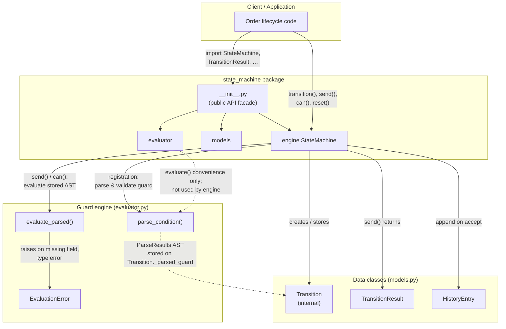
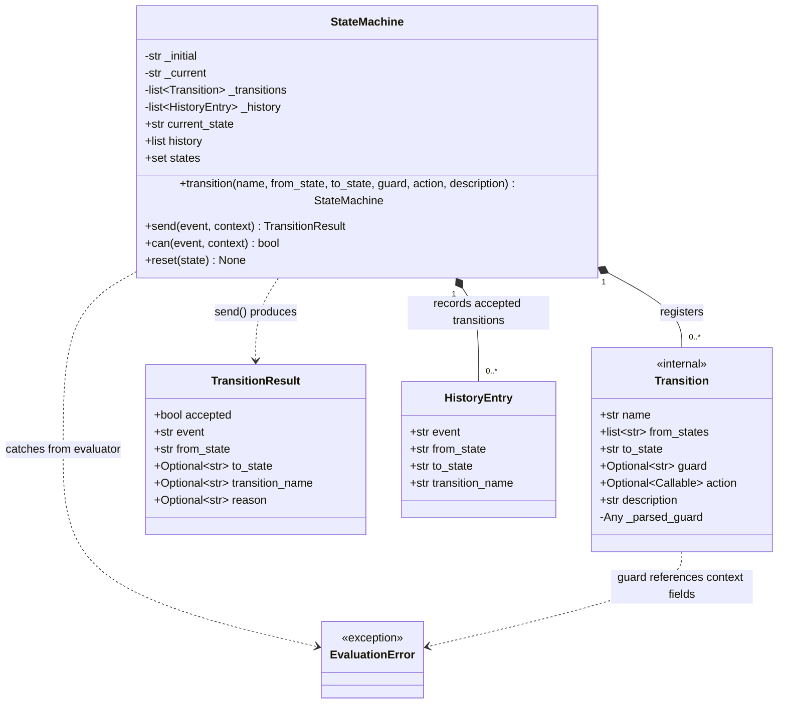

# State Machine Engine — Architecture

This document describes the target architecture defined in [SPEC.md](SPEC.md). Diagrams reflect the complete design, including features not yet implemented in the partial stub.

---

## 1. Component Diagram

Modules, classes, and how they interact at runtime.



### Key design decisions

- **Three-module split.** `engine.py` owns orchestration (registration, matching, state mutation, history). `evaluator.py` owns guard parsing and evaluation only. `models.py` holds plain data classes. Guard logic never leaks into the engine beyond calling `evaluate_parsed()` (runtime) and `parse_condition()` (registration).
- **Registration-time vs runtime work.** Guards are parsed once during `transition()` and the AST is stored on `Transition._parsed_guard`. `send()` and `can()` reuse the parsed tree — they never re-parses the guard string. Syntax errors fail fast at registration; runtime failures are field/type errors in context.
- **Parse error wrapping.** `parse_condition()` raises `ValueError` with a generic syntax message. `StateMachine.transition()` catches that and re-raises `ValueError` as `Invalid guard for transition '{name}': {detail}` so callers know which registration failed.
- **Internal vs public boundary.** `Transition` stays internal; the public surface (`__init__.py`) exports `StateMachine`, `EvaluationError`, `TransitionResult`, and `HistoryEntry` only. Callers interact with the engine, not transition records.
- **Result object, not exceptions, for operational failures.** `send()` always returns a `TransitionResult`. Guard failures, action errors, and invalid context are encoded in `accepted` and `reason` — the engine never raises during event processing.
- **Evaluator isolation.** All guard grammar, precedence, short-circuit evaluation, and dot-notation field access live in `evaluator.py`. The engine treats guards as opaque parsed expressions.
- **`StateMachine` scope (v1).** Registration, matching, guard orchestration, action invocation, state mutation, and history live in one class by design. This is orchestration, not guard grammar — splitting further (e.g. a separate action runner) is out of scope for v1. `evaluator.evaluate()` exists for tests and ad-hoc use; the engine never calls it — only `parse_condition()` at registration and `evaluate_parsed()` at runtime.
- **Guard parse timing.** Parsing runs exactly once per `transition()` call, before the `Transition` is appended. `guard=None` skips parsing and stores `_parsed_guard=None`. Syntax validation is complete at registration; runtime only evaluates the stored AST.

---

## 2. Sequence Diagram — Register Transition, Then `send()`

Happy path: register a guarded transition with an action, then fire it successfully.

```mermaid
sequenceDiagram
    actor Client
    participant SM as StateMachine
    participant TR as Transition
    participant EV as evaluator
    participant ACT as action callable

    Note over Client,ACT: Registration phase (fail-fast)

    Client->>SM: transition(name, from_state, to_state, guard, action)
    SM->>SM: normalise from_state → list[str]
    SM->>SM: check duplicate (name, from_state) overlap
    alt guard is not None
        SM->>EV: parse_condition(guard)
        EV-->>SM: ParseResults AST
        SM->>TR: create Transition(_parsed_guard=AST)
    else no guard
        SM->>TR: create Transition(_parsed_guard=None)
    end
    SM->>SM: append Transition to _transitions
    SM-->>Client: self (method chaining)

    Note over Client,ACT: Event processing phase (never raises)

    Client->>SM: send(event, context)
    alt context is not a dict
        SM-->>Client: TransitionResult(accepted=False,<br/>reason="Invalid context: …")
    else context valid
        SM->>SM: find first transition where<br/>name == event AND current_state in from_states
        alt no match
            SM-->>Client: TransitionResult(accepted=False,<br/>reason="No transition '…' from state '…'")
        else match found
            alt guard present
                SM->>EV: evaluate_parsed(_parsed_guard, context)
                alt EvaluationError raised
                    EV--xSM: EvaluationError
                    SM-->>Client: TransitionResult(accepted=False,<br/>reason="Guard error: …")
                else guard returns False
                    EV-->>SM: False
                    SM-->>Client: TransitionResult(accepted=False,<br/>reason="Guard condition not met: …")
                else guard returns True
                    EV-->>SM: True
                    SM->>SM: proceed to action / accept
                end
            else no guard
                SM->>SM: proceed to action / accept
            end
            opt proceed to action / accept
                opt action present
                    SM->>ACT: action(context)
                    alt action raises
                        ACT--xSM: exception
                        SM-->>Client: TransitionResult(accepted=False,<br/>reason="Action error: …")
                    else action succeeds
                        ACT-->>SM: return value (ignored)
                        SM->>SM: current_state ← to_state
                        SM->>SM: append HistoryEntry to _history
                        SM-->>Client: TransitionResult(accepted=True, …)
                    end
                else no action
                    SM->>SM: current_state ← to_state
                    SM->>SM: append HistoryEntry to _history
                    SM-->>Client: TransitionResult(accepted=True, …)
                end
            end
        end
    end
```

### Key design decisions

- **Two-phase lifecycle.** Registration is strict: invalid guards, empty `from_state`, and overlapping transitions raise `ValueError` immediately. Event processing is permissive: every failure path returns a structured `TransitionResult` without raising.
- **Atomic state change.** `current_state` and `_history` update only after guard passes (if any) and action succeeds (if any). A failed guard, guard error, or action exception returns immediately — state and history are untouched. (The sequence diagram nests rejection branches before the accept path; Mermaid shows all branches as alternatives, but only the success path reaches the state update.)
- **First-match wins.** When several transitions share the same event name and cover the current state, registration order determines the winner — there is no priority field in v1.
- **Action before state update, side effects not rolled back.** The action runs before the state change, but if it mutates `context` or performs external I/O and then raises, those mutations persist. Only machine state and history are protected.
- **Guard evaluation delegated.** The engine never interprets guard strings itself; it calls `evaluate_parsed()` with the AST stored at registration time, keeping parsing and evaluation concerns in one module.
- **`EvaluationError` is raised, not returned.** `evaluate_parsed()` propagates `EvaluationError` on missing fields and type errors. `send()` catches it and maps to `reason="Guard error: {message}"`. A guard that evaluates to `False` is a normal boolean result, not an exception.
- **Rejection `reason` templates.** Operational failures use fixed strings (see [SPEC.md](SPEC.md#rejection-reason-templates)): invalid context, no matching transition, guard error, guard not met, action error. Registration guard syntax errors raise `ValueError` with `Invalid guard for transition '{name}': {detail}`.

### `can()` — guard-only probe (no diagram)

`can(event, context=None)` mirrors `send()` steps 2–5 only: find first match, evaluate guard if present. It never invokes actions, never mutates `current_state` or `_history`. `context=None` is treated as `{}`. Non-dict `context` returns `False`. `EvaluationError` during guard evaluation returns `False` (same as guard `False`, but without a rejection reason — callers use `send()` when they need the message).

---

## 3. Class Diagram — Data Model

Fields and relationships for the engine's persistent and returned types.



### Key design decisions

- **States are inferred, not declared.** There is no `State` class. `StateMachine.states` derives the set from `_initial` plus every `from_states` and `to_state` on registered transitions. This keeps v1 minimal — no separate state registry or entry/exit hooks.
- **`from_states` is always a list.** Registration accepts `str | list[str]` but normalises to `list[str]` on `Transition`, so matching logic in `send()` is uniform (`current_state in t.from_states`).
- **Parsed guard is internal state on `Transition`.** `_parsed_guard` is not part of the constructor API; it is set after parsing during registration. This separates the human-readable `guard` string (for error messages) from the runtime AST.
- **`TransitionResult` is the full audit of a `send()` call.** It captures both outcomes: on acceptance, `to_state` and `transition_name` are populated; on rejection, `to_state` is `None` and `reason` carries a templated message. The caller never needs to catch exceptions from `send()`.
- **`HistoryEntry` is a slim audit record.** It stores only what changed on accepted transitions (event, from/to states, transition name). Rejected attempts are intentionally excluded — history is a success log, not a full event log.
- **`history` returns a copy.** The property exposes a shallow copy of `_history` so callers cannot mutate internal state. Combined with append-only accepted entries, this gives compliance-friendly immutability from the caller's perspective.

---

## 4. Long-Running Processes and Large Registries

v1 deliberately keeps simple list-based storage. No indexing, pruning, or persistence — but callers registering many transitions or running for a long time should understand the trade-offs.

| Concern | Behaviour in v1 | Implication |
| --- | --- | --- |
| Transition lookup | Linear scan of `_transitions` in registration order; first `(event, current_state)` match wins | Cost per `send()` / `can()` is **O(n)** in the number of registered transitions. Acceptable for typical order-lifecycle machines (dozens of transitions); large registries (hundreds+) may need a future index keyed by `(event, state)`. |
| History growth | Append-only; `reset()` clears history but not transitions | Accepted transitions accumulate without bound. Pruning is out of scope (see SPEC); long-lived machines should `reset()` or recreate the machine when audit windows roll over. |
| Registration growth | `_transitions` only grows; overlap detection rejects duplicates but never removes entries | Safe for configure-once machines. Dynamic re-registration at runtime increases scan cost and makes first-match order fragile — prefer registering the full rule set up front. |
| Parsed guard storage | One AST per guarded transition, set at registration | Memory is **O(transitions)**; no re-parsing overhead at runtime. |
| Action side effects | Not rolled back on failure | Over a long process, a failed action may leave context or external state partially mutated. Only `current_state` and `_history` are atomic with respect to `send()`. |

**First-match sensitivity at scale.** When many transitions share events or overlapping `from_states`, registration order determines which rule fires. There is no priority field — document registration order in application setup and avoid appending conflicting transitions later in the process.
