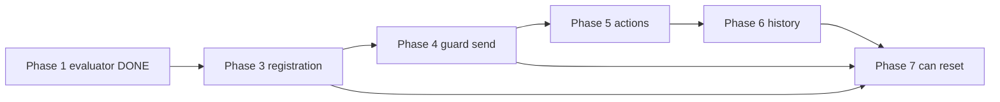

# State Machine Engine — Remaining Work Plan

**Baseline (verified 2026-06-14):** `uv run pytest tests/ -v` → **32 passed, 11 failed** (after Phase 3)

Derived from [SPEC.md](SPEC.md), [ARCHITECTURE.md](ARCHITECTURE.md), and the current `state_machine/` implementation.

**Package inventory (no invented modules):** `state_machine/__init__.py`, `engine.py`, `evaluator.py`, `models.py` — tests in `tests/test_engine.py`, `tests/test_evaluator.py`.

---

## Review audit

### DONE evidence verification

| Phase | Claim | Verdict |
| --- | --- | --- |
| 0 | Dataclasses in `models.py:5-31` | **Real** — `Transition`, `HistoryEntry`, `TransitionResult`; `_parsed_guard` on `Transition` at line 13 |
| 0 | Public exports in `__init__.py:1-4` | **Real** — `StateMachine`, `EvaluationError`, `TransitionResult`, `HistoryEntry` |
| 1 | 20 evaluator tests pass | **Real** — all `tests/test_evaluator.py` cases pass; `parse_condition()` at `evaluator.py:56`, `evaluate_parsed()` at `evaluator.py:125` |
| 2 | Engine stub line refs | **Real** — `__init__` 9–12, `transition()` 22–50, `send()` 52–63, rejection 65–74, `history` stub 18–20 |
| 2 | 6 engine tests pass | **Real** — see list below; count matches pytest output |
| 2 | `test_guard_passes` passes accidentally | **Accurate** — guard stored but never evaluated |
| 2 | `test_rejected_transition_not_in_history` passes trivially | **Accurate** — `history` always returns `[]` |
| 3 | Registration hardening line refs | **Real** — `states` 23–29, normalise 41–47, overlap 49–57, guard parse 59–77 |
| 3 | 6 registration tests pass | **Real** — `test_multi_source_from_state`, `test_multi_source_wrong_state`, `test_duplicate_transition_raises`, `test_duplicate_partial_overlap_raises`, `test_invalid_guard_raises_at_registration`, `test_states_property` |
| 4 | 3 guard acceptance tests pass | **Real** — `test_guard_fails_state_unchanged`, `test_guard_missing_field_rejected`, `test_guard_passes`; guard eval at `engine.py:96-114` |

**False-positive passes (will flip when TODO phases land):**

- ~~`test_guard_passes` — accepted without guard evaluation (Phase 4)~~ — fixed Phase 4
- `test_rejected_transition_not_in_history` — passes because history is empty; becomes a real assertion after Phase 4 + 6

### Invented files / modules

**None.** Every path and symbol in this plan exists in `state_machine/` or `tests/`. Engine work imports only `parse_condition` and `evaluate_parsed` from `evaluator.py` (ARCHITECTURE § 1).

### Failing tests → TODO phase mapping

| Failing test | Phase | Notes |
| --- | --- | --- |
| `test_guard_fails_state_unchanged` | 4 | **Fixed Phase 4** |
| `test_guard_missing_field_rejected` | 4 | **Fixed Phase 4** |
| `test_guard_compound` (first `send`) | 4 | **Fixed Phase 4** (reset half still Phase 7) |
| `test_action_mutates_context` | 5 | Action never invoked |
| `test_action_error_does_not_change_state` | 5 | Action never invoked |
| `test_history_tracks_accepted_transitions` | 6 | `_history` not implemented |
| `test_can_returns_true` | 7 | `can()` missing |
| `test_can_returns_false_wrong_state` | 7 | `can()` missing |
| `test_can_respects_guard` | 7 | `can()` missing; needs Phase 4 guard wiring |
| `test_reset_to_initial` | 7 | `reset()` missing; needs Phase 6 `_history` |
| `test_reset_to_specific_state` | 7 | `reset()` missing; **see test alignment note below** |
| `test_guard_compound` (after `reset()`) | 7 | `reset()` missing |

**Coverage:** all 11 remaining failing engine tests map to exactly one primary TODO phase. No orphan failures.

### Test / spec alignment flag

`test_reset_to_specific_state` calls `reset("processing")` with no registered transitions, so `sm.states == {"draft"}` per SPEC. A spec-compliant `reset(state)` must raise `ValueError` when `state ∉ sm.states`. **Before Phase 7 closes**, either:

1. Fix the test setup — register a transition with `to_state="processing"` so `"processing" ∈ sm.states`, or
2. Document and resolve the SPEC ↔ test conflict explicitly.

Phase 7 acceptance below assumes option 1 (test fix bundled with `reset()` implementation).

---

## DONE

### Phase 0 — Data model & public API

| Item | Evidence |
| --- | --- |
| `Transition`, `TransitionResult`, `HistoryEntry` dataclasses | `state_machine/models.py:5-31` — `_parsed_guard` field reserved on `Transition` |
| Public exports: `StateMachine`, `EvaluationError`, `TransitionResult`, `HistoryEntry` | `state_machine/__init__.py:1-4` |

`Transition` is internal (not exported) — matches SPEC § Public API and ARCHITECTURE § 1.

---

### Phase 1 — Guard evaluator (complete)

The Rules Engine condition language is fully implemented in `evaluator.py`: parsing, dot-notation field access, operators, precedence, short-circuit evaluation, and `EvaluationError` on missing fields.

**Evidence — all 20 evaluator tests pass:**

- `test_simple_comparison_true`, `test_simple_comparison_false`, `test_equality`
- `test_and_operator`, `test_or_operator`, `test_not_operator`
- `test_nested_field`, `test_deeply_nested_field`
- `test_in_operator`, `test_not_in_operator`
- `test_null_comparison`, `test_boolean_literal`
- `test_missing_field_raises`, `test_missing_nested_field_raises`, `test_invalid_syntax_raises`
- `test_short_circuit_or_skips_missing_field`, `test_short_circuit_and_skips_missing_field`
- `test_operator_precedence`, `test_empty_list_in`, `test_empty_list_not_in`

Key functions: `parse_condition()` at `evaluator.py:56`, `evaluate_parsed()` at `evaluator.py:125`. Engine must **not** call `evaluate()` (ARCHITECTURE § 1).

---

### Phase 2 — Engine stub (basic registration & send)

Partial `StateMachine` in `engine.py` supports init, single-source transition registration, and naive event matching.

| Item | Evidence |
| --- | --- |
| `__init__(initial)` sets `_initial` and `_current` | `engine.py:9-12` |
| `transition()` registers single `str` `from_state`, returns `self` | `engine.py:22-50` |
| `send()` matches `(event, current_state)`, updates `_current` on match | `engine.py:52-63` |
| Rejection when no transition matches | `engine.py:65-74` (wrong reason template — fixed in Phase 4) |

**Evidence — 6 engine tests pass:**

- `test_transition_accepted`
- `test_transition_rejected_wrong_state`
- `test_fluent_chaining`
- `test_same_event_different_source_states`
- `test_rejected_transition_not_in_history` *(trivial — history stub)*
- `test_guard_passes` *(accidental — guards not evaluated)*

**Known gaps at Phase 2 close (superseded where noted):**

- ~~`from_state` list raises `TypeError`~~ — fixed Phase 3
- ~~Duplicates silently overwrite~~ — fixed Phase 3
- ~~Guards not parsed at registration~~ — fixed Phase 3; evaluation deferred to Phase 4
- Actions stored but never invoked
- `history` property returns hard-coded `[]` (`engine.py:19-21`)
- `can()`, `reset()` not implemented
- `send()` updates state before guard/action (not atomic)

---

### Phase 3 — Transition registration hardening

Fail-fast registration per SPEC § Transition registration: list `from_state`, duplicate overlap detection, guard parsing at registration, and `states` property.

| Item | Evidence |
| --- | --- |
| `parse_condition` import | `engine.py:3` |
| `states` property (`_initial` ∪ `from_states` ∪ `to_state`) | `engine.py:23-29` |
| Normalise `str \| list[str]` → `list[str]`; reject `[]` | `engine.py:41-47` |
| Overlap detection on `(name, from_state)` | `engine.py:49-57` |
| Guard parse at registration; `_parsed_guard` stored once | `engine.py:59-66`, `engine.py:76-77` |
| `guard is None` → `_parsed_guard=None` (field default) | `models.py:13`; set only when parsed |

**Evidence — 6 engine tests pass:**

- `test_multi_source_from_state`
- `test_multi_source_wrong_state`
- `test_duplicate_transition_raises`
- `test_duplicate_partial_overlap_raises`
- `test_invalid_guard_raises_at_registration`
- `test_states_property`

**Spec-only checks verified:** empty `from_state=[]` → `ValueError`; invalid guard message `"Invalid guard for transition '{name}': …"`; self-transition accepted; guard AST not re-parsed on `send()`.

**Remaining gaps (drive Phases 5–7):** actions not invoked; `history` stub; `can()` / `reset()` missing; action execution deferred to Phase 5.

---

### Phase 4 — Guard-aware `send()`

| Item | Evidence |
| --- | --- |
| Context dict validation before matching | `engine.py:83-90` |
| Guard evaluation via `evaluate_parsed()` | `engine.py:96-114` |
| State unchanged on guard fail/error | `engine.py:96-114` (no `_current` update) |
| Updated no-match reason template | `engine.py:131` |
| `EvaluationError` import and catch | `engine.py:3`, `engine.py:99-105` |

**Evidence — 3 guard acceptance tests pass:**

- `test_guard_fails_state_unchanged`
- `test_guard_missing_field_rejected`
- `test_guard_passes`

**Spec-only checks verified:** `send("submit", None)` → `"Invalid context: context must be a dict"`; guard-fail reason template `"Guard condition not met: {guard}"`.

---

## TODO

Build order: registration hardening → `send()` pipeline (guard → action → state → history) → introspection.

Each phase is **one commit, one file** (`state_machine/engine.py` only). Revert = `git revert <sha>`.

### Phase 5 — Action execution & atomic state change

| | |
| --- | --- |
| **Goal** | Invoke actions after guard passes, before state update; action failure leaves state and history untouched |
| **Files** | `state_machine/engine.py` |
| **Prerequisites** | Phase 4 (guard gate before action) |
| **Architecture** | ARCHITECTURE § 2 action branch, atomic state change; SPEC § Actions |
| **Revertible** | Yes — single-file diff |

**Work:**

1. After guard passes (or no guard), if `t.action` is not `None`, call `t.action(context)`.
2. On any exception: return `TransitionResult(accepted=False, reason="Action error: {message}")` without updating `_current` or `_history`.
3. On success (or no action): set `_current = t.to_state`; proceed to history append (Phase 6).
4. Return `TransitionResult(accepted=True, event=…, from_state=old, to_state=t.to_state, transition_name=t.name)`.

**Acceptance — pytest (must pass):**

| Test | Asserts |
| --- | --- |
| `test_action_mutates_context` | Action runs and mutates context dict in-place |
| `test_action_error_does_not_change_state` | `RuntimeError("warehouse offline")` → rejected, `"warehouse offline" in reason`, state unchanged |

**Acceptance — spec-only:**

| Check | Expected |
| --- | --- |
| Action side effects before exception | Context mutations persist; only `_current` and `_history` protected |
| `can()` with failing action | Not in scope here — Phase 7 |

**Verify:** `uv run pytest tests/test_engine.py -k "action" -v`

**Spec refs:** SPEC § Actions, § Event processing step 6, ARCHITECTURE § 2 atomic state change.

---

### Phase 6 — History tracking

| | |
| --- | --- |
| **Goal** | Append-only audit log of accepted transitions; rejected events excluded |
| **Files** | `state_machine/engine.py` |
| **Prerequisites** | Phase 5 (append only on full accept path) |
| **Architecture** | ARCHITECTURE § 1 (`append on accept`), § 3 `HistoryEntry`, `history` shallow copy |
| **Revertible** | Yes — single-file diff |

**Work:**

1. Add `self._history: list[HistoryEntry] = []` in `__init__` (import `HistoryEntry` from `.models`).
2. On accepted `send()` only, append `HistoryEntry(event=event, from_state=old_state, to_state=t.to_state, transition_name=t.name)`.
3. Replace `history` stub: return `list(self._history)` (shallow copy).

**Acceptance — pytest (must pass):**

| Test | Asserts |
| --- | --- |
| `test_history_tracks_accepted_transitions` | Two accepted sends → `len(sm.history) == 2`; entries have correct `from_state` / `to_state` |
| `test_rejected_transition_not_in_history` | Guard-failed send → `len(sm.history) == 0` (real assertion, not trivial) |

**Acceptance — spec-only:**

| Check | Expected |
| --- | --- |
| `h = sm.history; h.clear()` | Subsequent `sm.history` unchanged (copy semantics) |
| `HistoryEntry.transition_name` | Matches transition `name` |

**Verify:** `uv run pytest tests/test_engine.py -k "history" -v`

**Spec refs:** SPEC § `history` property, § `HistoryEntry`, § Acceptance Criteria — History.

---

### Phase 7 — `can()` and `reset()`

| | |
| --- | --- |
| **Goal** | Guard-only probe and lifecycle reset without modifying transitions |
| **Files** | `state_machine/engine.py` |
| **Prerequisites** | Phase 3 (`states`), Phase 4 (guard eval for `can()`), Phase 6 (`_history` to clear) |
| **Architecture** | ARCHITECTURE § 2 `can()` guard-only probe; § 3 `StateMachine.can`, `reset` |
| **Revertible** | Yes — single-file diff |

**Pre-flight — fix test setup:**

Update `test_reset_to_specific_state` to register `"processing"` before calling `reset("processing")`:

```python
sm.transition("go", from_state="draft", to_state="processing")
sm.reset("processing")
```

Without this, a spec-compliant `reset()` raises `ValueError` and the test cannot pass.

**Work:**

1. **`can(event, context=None)`** — mirror `send()` steps 2–5 only:
   - `context is None` → treat as `{}`
   - Non-`dict` context → return `False`
   - Find first matching transition for current state
   - Evaluate guard via `evaluate_parsed` if present; `EvaluationError` → `False`
   - Never invoke actions; never mutate `_current` or `_history`
2. **`reset()`** — `_current = _initial`, `_history.clear()` (or `= []`)
3. **`reset(state)`** — if `state not in self.states`, raise `ValueError`; else `_current = state`, clear history
4. Registered transitions untouched

**Acceptance — pytest (must pass):**

| Test | Asserts |
| --- | --- |
| `test_can_returns_true` | Matching transition from current state |
| `test_can_returns_false_wrong_state` | No match from current state |
| `test_can_respects_guard` | Guard true/false reflected; no state change |
| `test_reset_to_initial` | After send + `reset()` → `current_state == "draft"`, `history == []` |
| `test_reset_to_specific_state` | `reset("processing")` with `"processing" ∈ sm.states` |
| `test_guard_compound` | Compound guard pass, then after `reset()` fail with mutated context |

**Acceptance — spec-only:**

| Check | Expected |
| --- | --- |
| `sm.reset("unknown")` when `"unknown" ∉ sm.states` | `ValueError` |
| `can()` when action would raise | Returns `True`; `send()` returns `Action error: …` (SPEC § `can()` does not run actions) |

**Verify:** `uv run pytest tests/test_engine.py -k "can or reset or guard_compound" -v`

**Spec refs:** SPEC § `can()`, § `reset()`, ARCHITECTURE § 2 `can()` guard-only probe.

---

## Completion gate

When all TODO phases are done:

```bash
uv run pytest tests/ -v
```

Expected: **43 passed, 0 failed**.

### Regression checklist (spec behaviours without dedicated tests)

Implement and spot-check during Phases 4–7:

| Behaviour | Phase | Check |
| --- | --- | --- |
| `send("submit", None)` → invalid context reason | 4 | Done |
| `reset("unknown")` → `ValueError` | 7 | REPL |
| `can()` returns `True` when action would fail | 7 | REPL per SPEC acceptance example |
| `history` returns shallow copy | 6 | REPL |
| Empty `from_state=[]` → `ValueError` | 3 | Done — `engine.py:46-47` |
| Registration guard message includes transition name | 3 | Done — `engine.py:64-66` |

### Phase dependency graph


